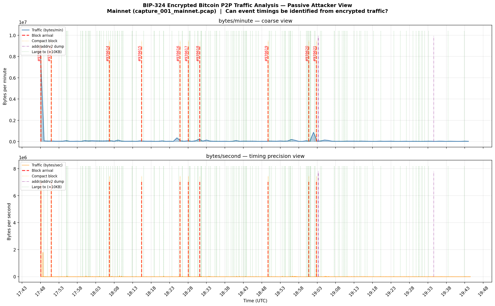
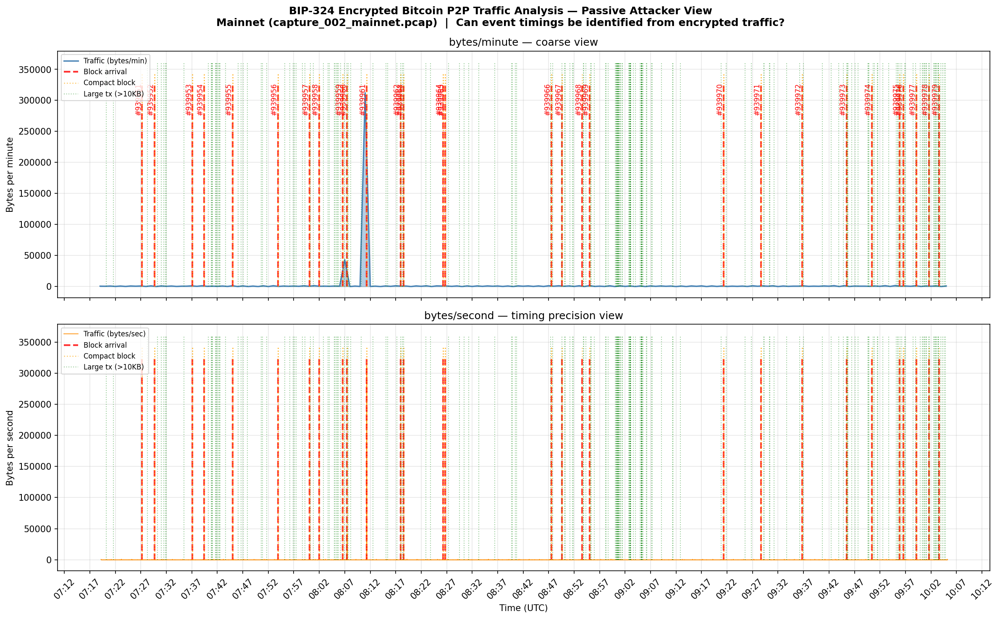

# Passive Traffic Analysis of BIP-324 Encrypted Bitcoin P2P Connections

## What This Research Is About

Bitcoin's BIP-324 upgrade encrypts all P2P traffic between nodes using
ElligatorSwift ECDH key exchange and ChaCha20Poly1305 authenticated encryption.
The goal is to make it harder for a network observer — an ISP, a BGP hijacker,
or any entity with access to the wire — to read or tamper with Bitcoin's gossip
protocol.

But encryption hides *content*, not *shape*. A passive observer who cannot
decrypt a single byte can still see how many bytes crossed the wire and exactly
when. This research asks: **is that enough?**

Specifically: can an attacker observing only packet sizes and timestamps on an
encrypted BIP-324 link determine when specific Bitcoin protocol events occurred
on a target node — block arrivals, compact block relay, transaction propagation,
and peer discovery messages?

---

## Why It Matters

If the answer is yes, then:

- A surveillance actor (ISP, state-level adversary) can silently build a
  timeline of which node received which block, and when — without breaking any
  cryptography.
- A BGP hijacker can confirm, after the fact, that a targeted node was isolated
  at a specific block height.
- Node configuration (full-relay vs blocksonly) can be fingerprinted from the
  outside, leaking operator intent.
- The BIP-324 handshake itself may be distinguishable from other TLS-like
  protocols, defeating protocol obfuscation.

BIP-324's own specification acknowledges this: it states explicitly that
"traffic analysis based on packet sizes and timing is outside the scope of
this BIP." This research is an empirical measurement of how much that
acknowledged gap costs in practice.

---

## What Was Done

Two Bitcoin Core v28.1 nodes were deployed on DigitalOcean (Mainnet), connected
to each other over a private network link. tcpdump captured all traffic on that
link while the nodes ran normally — receiving real blocks and transactions from
the wider Bitcoin network. The debug logs from one node provided ground-truth
event timestamps.

Three captures were performed:

1. **BIP-324 handshake capture** (29 KB) — a single connection setup, analysed
   for byte-level symmetry to test whether the handshake is distinguishable from
   TLS 1.3.

2. **Full-relay capture** (116 minutes, 10 blocks, 15 MB) — both nodes in
   default configuration, relaying transactions and blocks.

3. **Blocksonly capture** (166 minutes, 29 blocks, 469 KB) — Node B configured
   with `blocksonly=1`, suppressing all transaction relay.

For each block, transaction, and peer-discovery event recorded in the debug log,
the analysis script checked whether the encrypted traffic showed a statistically
significant spike at that moment — a per-second byte count more than 2× the
rolling 60-second baseline. An event that crossed this threshold was counted as
"visible" to a passive observer.

---

## Key Results

| Event | Full-Relay | Blocksonly |
|-------|-----------|------------|
| Block arrivals | **8/10 visible (80%; 95% CI: 49–94%)** | **27/29 visible (93%; 95% CI: 78–98%)** |
| Compact block relay | 16/25 visible (64%; CI: 45–80%) | 38/56 visible (68%; CI: 55–79%) |
| Large transactions (>10 KB) | 23/136 visible (17%; CI: 12–24%) | 0% — no tx data on link |
| getaddr / addr responses | 0/3 visible (0%) — not detectable | N/A |
| BIP-324 handshake vs TLS 1.3 | **Distinguishable** (symmetry ratio 0.62x vs 3–50x for TLS) | — |
| Node config fingerprintable | **Yes** — 46 vs 2,171 bytes/sec average | — |

**Counterintuitive finding:** Switching to `blocksonly` mode makes block
arrivals *more* detectable (93% vs 80%), not less. Removing transaction relay
eliminates the noise floor that previously masked block spikes.

---

## Full Research Report

The complete methodology, event-by-event results, BIP-324 handshake analysis,
comparison with prior BitSniff-era (V1) work, and answers to all five research
questions are written up in:

**[Mainnet_research.md](Mainnet_research.md)**

---

## Traffic Visualisations

### Capture 001 — Full-Relay (116 minutes, 10 blocks)


### Capture 002 — Blocksonly (166 minutes, 29 blocks)


---

## Repository Structure

```
├── Mainnet_research.md          # Full research report
├── SETUP.md                     # Step-by-step reproduction guide
├── requirements.txt             # Python dependencies
│
├── analysis/
│   ├── analyze_capture.py       # Event visibility pipeline
│   ├── analyze_handshake.py     # BIP-324 handshake fingerprint analysis
│   ├── analysis_001_mainnet.txt # Full-relay results (raw output)
│   ├── analysis_002_mainnet.txt # Blocksonly results (raw output)
│   ├── analysis_handshake_bip324.txt  # Handshake fingerprint output
│   └── plots/
│       ├── traffic_vs_blocks_capture_001_mainnet.png
│       └── traffic_vs_blocks_capture_002_mainnet.png
│
└── captures/
    ├── README.md                # Capture file descriptions and download links
    └── mainnet/
        ├── capture_bip324_handshake.pcap   # 29 KB — BIP-324 handshake
        ├── capture_001_mainnet.pcap        # 15 MB — full-relay, 116 min
        └── capture_002_mainnet.pcap        # 469 KB — blocksonly, 166 min
```

---

## References

| Resource | Link |
|----------|------|
| Original research task | https://github.com/0xB10C/project-ideas/issues/12 |
| BIP-324 specification | https://github.com/bitcoin/bips/blob/master/bip-0324.mediawiki |
| BIP-152 compact block relay | https://github.com/bitcoin/bips/blob/master/bip-0152.mediawiki |
| BitSniff (prior work, V1 era) | https://79jke.github.io/BitSniff/ |
| Bitcoin Core v28.1 | https://bitcoincore.org/en/releases/28.1/ |

---

**Author:** Arowolo Kehinde — March 2026
